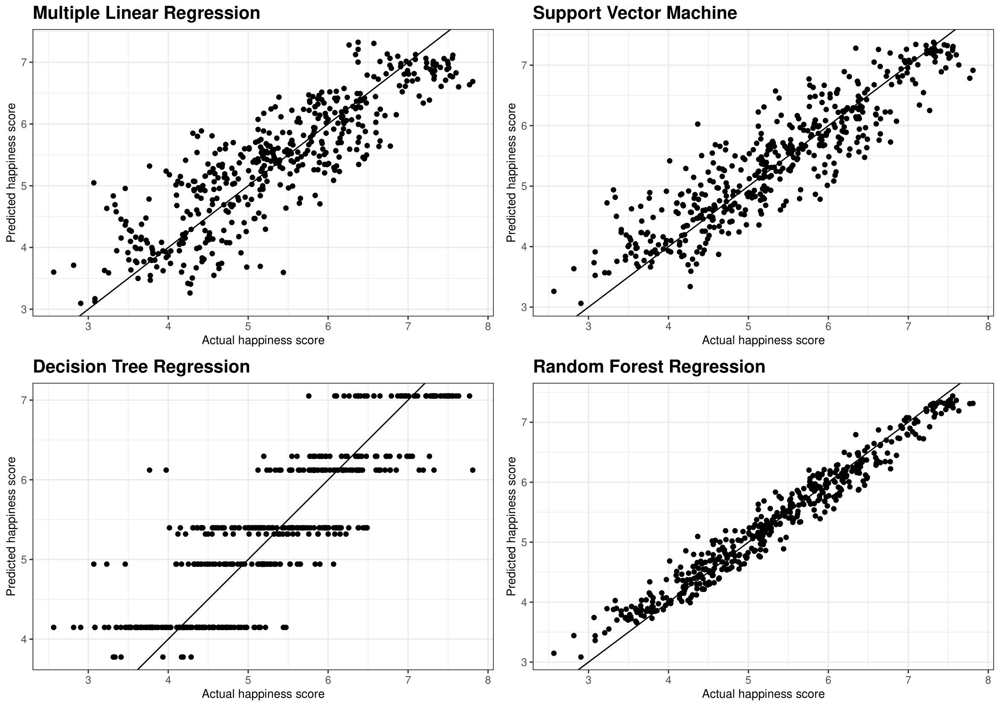
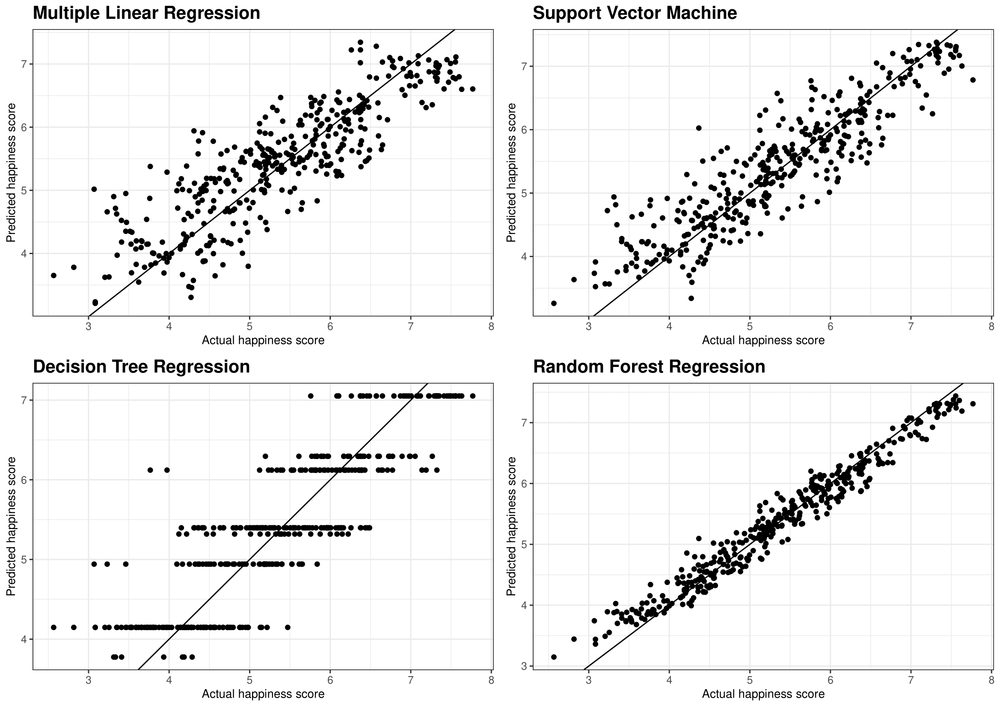
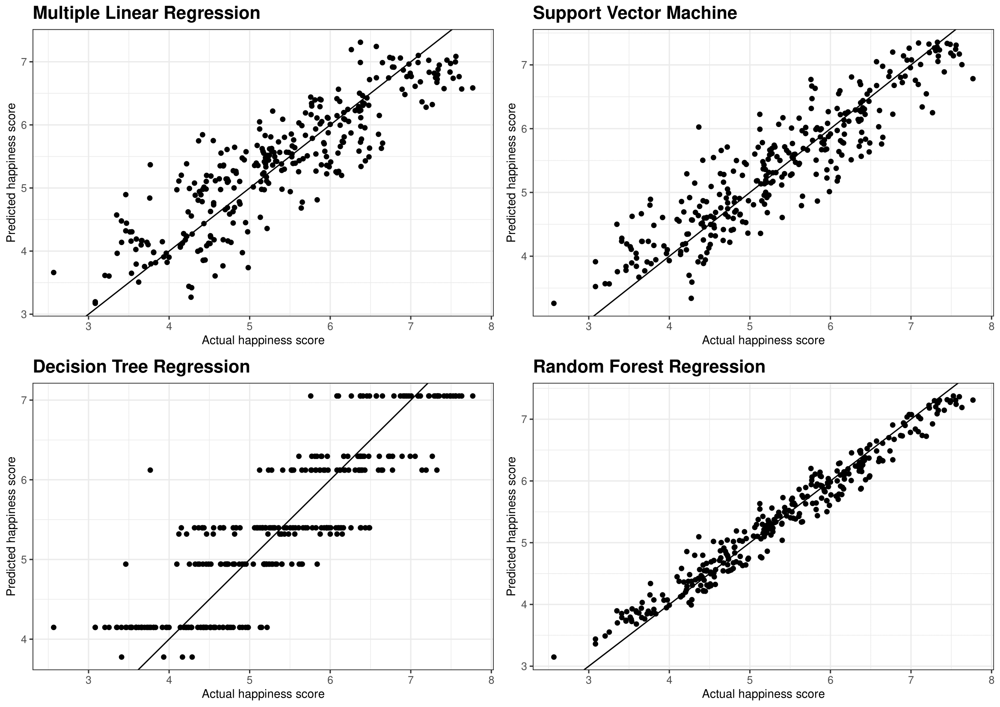
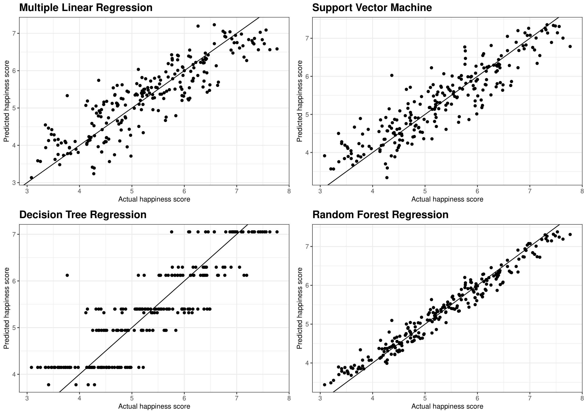

```{r setup, echo = FALSE,warning=FALSE, message=FALSE}
knitr::opts_chunk$set(echo = FALSE,warning=FALSE, message=FALSE)
library(tidyverse)
library(gganimate) 
library(GGally)
library(fpp3)
library(ggplot2) # Data visualization
library(readr) # read data files 
library(dplyr)
library(gridExtra)
library(RColorBrewer)
library(repr)
library(neuralnet)
library(ggpubr)
library(caTools)
library(rworldmap)# Draw world map 
library(rnaturalearth)
library(sf)
library(car)
```


```{r}
data2016 = read_csv("data/2016.csv")
data2017 = read_csv("data/2017.csv")
data2018= read_csv("data/2018.csv")
data2019 = read_csv("data/2019.csv")
data2020 = read_csv("data/2020.csv")


hap16 = read_csv("data/2016.csv")
hap17 = read_csv("data/2017.csv")
hap18 = read_csv("data/2018.csv")
hap18$`Perceptions of corruption` = as.numeric(hap18$`Perceptions of corruption`)
hap19 = read_csv("data/2019.csv")
hap20 = read_csv("data/2020.csv")


```

```{r data_Preparation}

data2016 <- data2016 %>% 
  select(Country,`Happiness Score`,
         `Economy (GDP per Capita)`,
         `Health (Life Expectancy)`,
         Freedom, Generosity) %>% 
  rename('Happiness Score' = 'Happiness Score',
         'Economy' = 'Economy (GDP per Capita)',
         'Health' = 'Health (Life Expectancy)') %>% 
  mutate(Year = 2016)


data2017 <- data2017 %>% 
  select(Country,Happiness.Score,
         Economy..GDP.per.Capita.,
         Health..Life.Expectancy.,
         Freedom, Generosity) %>% 
  rename('Happiness Score' = 'Happiness.Score',
         'Economy' = 'Economy..GDP.per.Capita.',
         'Health' = 'Health..Life.Expectancy.') %>% 
  mutate(Year = 2017)

data2018 <- data2018 %>% 
  select(`Country or region`,
         Score,
         `GDP per capita`,
         `Healthy life expectancy`,
         `Freedom to make life choices`,
         `Generosity`) %>%
  rename('Country' = 'Country or region',
         'Happiness Score' = 'Score',
         'Economy' = 'GDP per capita',
         'Health' = 'Healthy life expectancy',
         'Freedom' = 'Freedom to make life choices') %>% 
  mutate(Year = 2018)

data2019 <- data2019 %>% 
  select(`Country or region`,
         Score,
         `GDP per capita`,
         `Healthy life expectancy`,
         `Freedom to make life choices`,
         `Generosity`) %>%
  rename('Country' = 'Country or region',
         'Happiness Score' = 'Score',
         'Economy' = 'GDP per capita',
         'Health' = 'Healthy life expectancy',
         'Freedom' = 'Freedom to make life choices') %>% 
  mutate(Year = 2019)

data2020 <- data2020 %>% 
  select(`Country name`,
         `Ladder score`,
         `Explained by: Log GDP per capita`,
         `Explained by: Healthy life expectancy`,
         `Freedom to make life choices`,
         `Generosity`) %>%
  rename('Country' = 'Country name',
         'Happiness Score' = 'Ladder score',
         'Economy' = 'Explained by: Log GDP per capita',
         'Health' = 'Explained by: Healthy life expectancy',
         'Freedom' = 'Freedom to make life choices') %>% 
  mutate(Year = 2020)

```

```{r}
dataall <- rbind(data2016, data2017, data2018, data2019, data2020)
```


```{r message=FALSE, warning=FALSE}
# Combine new data from world bank about CPI and Population up to 2020 


world_map = ne_countries(returnclass = 'sf')
cpi = read_csv("data/API_FP.CPI.TOTL.ZG_DS2_en_csv_v2.csv", skip = 4)
population = read_csv("data/API_SP.POP.TOTL_DS2_en_csv_v2.csv", skip = 4)
```


```{r}
# Wrangling the data to combine the new data with 2016-2020 happiness report data

temp <- hap16 %>% 
  dplyr::select(Country, `Happiness Score`, `Health` = `Health (Life Expectancy)`, `Economy` = `Economy (GDP per Capita)`) %>%
  mutate(year = 2016)

temp <- hap17 %>%
  dplyr::select(Country, `Happiness Score` = Happiness.Score, `Economy` = Economy..GDP.per.Capita., `Health` = Health..Life.Expectancy.) %>%
  mutate(year = 2017) %>%
  rbind(temp) 

temp <- hap18 %>%
  dplyr::select(Country = `Country or region`, `Happiness Score` = Score, `Health` = `Healthy life expectancy`, `Economy` = `GDP per capita`) %>%
  mutate(year = 2018) %>%
  rbind(temp)

temp <- hap19 %>%
  dplyr::select(Country = `Country or region`, `Happiness Score` = Score, `Health` = `Healthy life expectancy`, `Economy` = `GDP per capita`) %>%
  mutate(year = 2019) %>%
  rbind(temp) 

temp <- hap20 %>%
  dplyr::select(Country = `Country name`, `Happiness Score` = `Ladder score`, `Health` = `Healthy life expectancy`, `Economy` = `Explained by: Log GDP per capita`) %>%
  mutate(year = 2020)%>%
  rbind(temp)


hapall <- temp 

hapall <- population %>%
  dplyr::select(Country = `Country Name`, `2016`:`2020`) %>%
  gather(key = 'year', value = 'population', `2016`:`2020`) %>%
  mutate(year = as.numeric(year)) %>%
  right_join(hapall) 

hapall <- cpi %>%
  dplyr::select(Country = `Country Name`, `2016`:`2020`) %>%
  gather(key = 'year', value = 'cpi', `2016`:`2020`) %>%
  mutate(year = as.numeric(year)) %>%
  right_join(hapall) 


```


```{r}
# Remove the NA values 
narm_hapall = na.omit(hapall)

lognarm_hapall <- narm_hapall %>%
  mutate(log_score = log(`Happiness Score`), log_eco = log(Economy), log_health = log(Health), log_population = log(population)) %>% 
  dplyr::select(Country, year,log_score, log_eco, log_health, log_population, cpi) %>% 
  na.omit() %>% tibble()

lognarm_hapall <- do.call(data.frame,lapply(lognarm_hapall,function(x) replace(x, is.infinite(x), NA)))

```

\clearpage


# Modelling 


## What is the most important variable to explain the happiness score differences across different countries in different years? 


In this part, due to there are some different variables across each year in our data, we only keep the common variables  (Economy, Health, Generosity and Freedom) for these years to conduct our analysis. To explore the factors that could be contributing to the happiness score differences between each year, we first test few common models listed in Table\ref{models}: 


\begin{table}[H]
\scalebox{0.8}{
\begin{tabular}{|c|c|}
\hline
\textless{}Trained Models \textgreater{} & \textless{}Model description \textgreater{}                                       \\
\hline\hline
\textbf{Multivariate Linear Model}       & Simple Linear regression with multiple variables                                  \\
\hline
Support Vector Machine Model             & Use multiple learning algorithms (resampling and tree) to give us better results. \\
\hline
\textbf{Decision Tree Model}             & Binary tree model have control statement.                                         \\
\hline
Random Forest Model                      & Use multiple learning algorithms (resampling and tree) to give us better results.\\
\hline
\end{tabular}}
\caption{Model Description of our Trained Models}
\label{models}
\end{table}


After trained our model based on the all historical data (from 2015 to 2022). We can see from the Figure \@ref(fig:training) that the best model to fit the data is Random Forest model while the Multivariate and SVM performed similarly. The decision tree performed the worst because it changed the structure of the data. The result is similar when we have different training split ratios (see Figure \@ref(fig:ggsp04) to \@ref(fig:ggsp07)). 

\newpage

```{r training, fig.cap="Model Training Split Ratio is 0.8"}
set.seed(1999)
happiness <- dataall %>% na.omit()

dataset <- happiness[2:6] %>% na.omit()
  
split <- sample.split(dataset$`Happiness Score`, SplitRatio = 0.8)


training_set <- subset(dataset, split == TRUE)
test_set <- subset(dataset, split == FALSE)

# Linear model 
regressor_lm = lm(formula = `Happiness Score` ~ . ,data = training_set )

# Linear plot 
y_pred_lm <- predict(regressor_lm, newdata = test_set)

Pred_Actual_lm <- as.data.frame(cbind(Prediction = y_pred_lm, Actual = test_set$`Happiness Score`))

gglm <- ggplot(Pred_Actual_lm, aes(Actual, Prediction )) +
  geom_point() + theme_bw() + geom_abline() +
  labs(title = "Multivariate Regression", x = "Actual happiness score",
       y = "Predicted happiness score") +
  theme(plot.title = element_text(family = "Helvetica", face = "bold", size = (15)), 
        axis.title = element_text(family = "Helvetica", size = (10)))


# SVM

library(e1071)
regressor_svm = svm(formula = `Happiness Score` ~ .,
                data = dataset,
                type = 'eps-regression',
                kernel = 'radial')


y_pred_svr = predict(regressor_svm,  newdata = test_set)

Pred_Actual_svr <- as.data.frame(cbind(Prediction = y_pred_svr, Actual = test_set$`Happiness Score`))


Pred_Actual_lmversus.svr <- cbind(Prediction.lm = y_pred_lm, Prediction.svr = y_pred_svr, Actual = test_set$Happiness.Score)

# SVR plot 
gg.svr <- ggplot(Pred_Actual_svr, aes(Actual, Prediction )) +
  geom_point() + theme_bw() + geom_abline() +
  labs(title = "Support Vector Machine", x = "Actual happiness score",
       y = "Predicted happiness score") +
  theme(plot.title = element_text(family = "Helvetica", face = "bold", size = (15)),
        axis.title = element_text(family = "Helvetica", size = (10)))


# Decision Tree model 
# Fitting Decision Tree Regression to the dataset
library(rpart)
regressor_dt = rpart(formula = `Happiness Score` ~ .,
                  data = dataset,
                  control = rpart.control(minsplit = 10))


# Predicting a new result with Decision Tree Regression
y_pred_dt = predict(regressor_dt, newdata = test_set)

Pred_Actual_dt <- as.data.frame(cbind(Prediction = y_pred_dt, Actual = test_set$`Happiness Score`))


gg.dt <- ggplot(Pred_Actual_dt, aes(Actual, Prediction )) +
  geom_point() + theme_bw() + geom_abline() +
  labs(title = "Decision Tree Regression", x = "Actual happiness score",
       y = "Predicted happiness score") +
  theme(plot.title = element_text(family = "Helvetica", face = "bold", size = (15)), 
        axis.title = element_text(family = "Helvetica", size = (10)))


# Random Forest

library(randomForest)
set.seed(1234)
regressor_rf = randomForest(x = dataset[-1],
                         y = dataset$`Happiness Score`,
                         ntree = 1000)

# Predicting a new result with Random Forest Regression
y_pred_rf = predict(regressor_rf, newdata = test_set)

Pred_Actual_rf <- as.data.frame(cbind(Prediction = y_pred_rf, Actual = test_set$`Happiness Score`))


gg.rf <- ggplot(Pred_Actual_rf, aes(Actual, Prediction )) +
  geom_point() + theme_bw() + geom_abline() +
  labs(title = "Random Forest Regression", x = "Actual happiness score",
       y = "Predicted happiness score") +
  theme(plot.title = element_text(family = "Helvetica", face = "bold", size = (15)), 
        axis.title = element_text(family = "Helvetica", size = (10)))


ggsp07 <- ggarrange(gglm, gg.svr, gg.dt, gg.rf, ncol = 2, nrow = 2) +
   labs(title = "Training and Test Split Ratio = 0.8" )


ggsp07
```


### Random Forest regression 

Random Forest Model have the variable selecting system (via bootstrapping) to decide the most significant tree and can reduce overwriting compared with decision tree.With that said, random forests are a strong modeling technique and much more robust comparing with many different methods [@liberman2017]. We can see from the plot that this model have captured the data well in the past few years for various training set (see Figure \@ref(fig:ggsp04) to \@ref(fig:ggsp07)). . 

To get which are the most important variables, we then check their loadings in RF model (see Table \@ref(tab:varimp)). 


\newpage
```{r varimp}
regressor_rf[["importance"]] %>%
  as.data.frame() %>% 
  arrange(desc(IncNodePurity)) %>% 
  knitr::kable(caption = "Variable importance for Random Forest model", digits = 4) %>%
  kableExtra::kable_styling(latex_options = "striped")

```


In the Table \@ref(tab:varimp), we conclude that the most important variables on explaining the happiness scores will be the Happiness and Health due to the loading for them are significant higher than others. 


## Multivariate Linear Model Analysis. 


One advantage of multivariate linear regression is that it can allow us to analyse the relationship between different variables in a statistical coherent way @voxco2022. For example, marginal effects and percentage changes.


In our classic linear model, which is 

$$
\begin{aligned}
&\textbf{Classic Multivariate Linear Model}:\\
Happiness\ score=& Economy+Health+Generosity+Freedom
\end{aligned}
$$

We can see from Table \@ref(tab:without), in our classic linear model, they have similar loadings and all of them are significant, which we cannot tease out the important variables out of this model. 


```{r without}

lm  <- lm(`Happiness Score`~  Health + Economy + Freedom + Generosity, data=dataall)

sumtable <- summary(lm)

sumtable$coefficients %>%
  knitr::kable(caption = "Linear regression model for happiness scores without new data", digits = 4) %>%
  kableExtra::kable_styling(latex_options = "striped")

```


In order to better analyse the relationships, we join another two new variables, which are CPI values and the population size for each country from The World Bank data (@world2022) between 2016 to 2022. After matching the data for each country and drop the NA values. We can use the new dataset to construct our new Linear model. Nevertheless, due to the limitation of the new dataset, we can only conduct our analysis based on the data up to 2020.


$$
\begin{aligned}
\textbf{Logarithm Multivariate Linear Model with added variables}:\\
log(score)= -4.6000-0.0008\ cpi+0.2591\ log(economy)\\-0.0026\ log(population)+0.0114\ log(health)+0.0032log(year)
\end{aligned}
$$

```{r mle}


log_lm  <- lm(log_score~ cpi+ log_eco + log_population + log_health + year, data=lognarm_hapall) 

logsum <- summary(log_lm)


logsum$coefficients %>%
  knitr::kable(caption = "Multivariate Linear regression model for the log data with R-squared is 0.6076", digits = 4) %>%
  kableExtra::kable_styling(latex_options = "striped")

```


We can see in Table \@ref(tab:mle) that the total proportion of variance explained by the model with these variables are 60.76%. For the 4 predictors, the economy status(GDP per capita) contribute most to the happiness scores than other variables. 


Note that in econometric contexts, the intercept in log-linear model can be interpreted as the influence of one percentage change of a variable to dependent variable [@benoit2011]. For example: 
\begin{align*}
\frac{\Delta \text{ log(Happiness Score)}}{\Delta \text{ log(Economy)}} &\approx \frac{\Delta \text{ Happiness Score}}{\Delta \text{ Economy} }\frac{\text{Economy}}{\text{Happiness Score}}\\
&=\frac{\% \Delta \text{ Happiness Score}}{\% \Delta \text{ Economy}} \nonumber\\
&= \text{ME(Coefficient)}\nonumber\\
&= 0.2591
\end{align*}

Here, we can interpret that a 1% increase in Economy(measured in GDP per capita) will lead to a 0.2591% rise in the happiness score. Similarly for the rest variables, a 1% percent increase in health will increase happiness for 0.0114%. On the contrary, we can see that a rise in population and CPI have a negative impact with -0.0026% and -0.0008 respectively. 


# Endogenity and Sample Selection Bias 

We only included 5 variables and total $R^2$ is around 60.49% in our model. Then, considering the happiness score can be affected by many prospects. There should have some latent variables that do affect the happiness score for example the education level and culture backgrounds. In other words, our model have an endogeneity issue, which we can solve it by either adding more related variables or use the two-stage least square model. 


```{r worldmapall, results='hide', fig.cap= "Colour the country that have included in Worldmap"}
library(rnaturalearth)

map <-ne_countries(returnclass = "sf")

map$not_included = is.na(sapply(world_map$name, match, table = hapall$Country))

ggplot()+
  geom_sf(data = map, aes(fill = !not_included))+
  ggtitle("Country included in our dataset ", subtitle = "Red: Countries are not Included; Blue:Countries are included") +
  theme_bw()+
  theme(legend.position = 'bottom') +
  labs(fill = "Included")
```


Apparently, our model have some bias in selecting our sample. In our report, there are `r table(map$not_included)["TRUE"]` are not included, which have been colored in red from Figure \@ref(fig:worldmapall). In our sample, we can see countries are not included either from sparsely populated area or developing countries, which indicates that our sample is not random enough and exists a sample selection bias. To solve this, sample selection models such as Heckman model or Tobit can be considered in Econometrics areas. 


\newpage

# Residual Diagonistic of Regression Model 


The diagnostic of our regression model is shown in Figure \@ref(fig:resd). From the Residual and Fitted plot, we can see it has non-constant variance across the fitted value, which means the presence of Hetroskedasticity. Moreover,both the error distribution (see Figure \@ref(fig:density)) and the Q-Q plot Figure (see  both Figure \@ref(fig:qq) and Figure \@ref(fig:inf)  also suggest the density of our model is close to a normal distribution but seems there are some influences by outliers.


```{r density,fig.cap="Distribution of the residual term"}
#Data Partitioning
set.seed(1999)
# function that return the residual plot 

residplot <- function(log_lm, nbreaks=30) {
  z <- rstudent(log_lm)
  hist(z, breaks=nbreaks, freq=FALSE, xlab="Studentized Residual",main="Distribution of Errors")
  rug(jitter(z), col="brown")
  curve(dnorm(x, mean=mean(z), sd=sd(z)), add=TRUE, col="red", lwd=1) 
  lines(density(z)$x, density(z)$y, col="green", lwd=2, lty=2) 
  legend("topright",legend = c( "Normal Curve", "Kernel Density Curve"),lty=1:2, col=c("red","green"), cex=.7)
}

g1 <- residplot(log_lm)

```


```{r resd, fig.cap="Residual vs Fitted value plot (with standardised residuals)"}
 plot(log_lm, which = 3) #residuals vs Fitted

```


```{r qq, fig.cap="Q-Q plot fitted model residual density vs normal distribution residual density"}
pp <- plot(log_lm, which = 2, main = "Normal Q-Q plot", sub = "In this Figure, the dotted line is Normal Distribution") 

```


```{r inf, fig.cap="Influence Plot, the bigger circle means outliers", results='hide'}

influencePlot(log_lm, main = "Influence Plot", sub = "Circle size is proportial to Cook's Distance")
```


\clearpage

# Conclusion 


In conclusion, our model did a good job in explaining the relationships between happiness score and our selected aggressors even though there are still some limitations. 


\clearpage
# Appendix

\begin{align*}
\intertext{We here take the Economy Situation (measured in GDP per capita) as an example:}
\frac{\partial \text{log(Happiness Score)}}{\partial \text{log(Economy)}} &= \text{ME(Coefficient)}\\
\intertext{From (1) we can say, when other variables remain constant }\nonumber \\
\Delta \text{ log(Happiness Score)} &= \text{ME(Coefficient)} \times \Delta \text{ log(Economy)}\\
\intertext{By using the infinite approaching approximation of log function, we can know}\nonumber\\
log(x_0 + \Delta x) - log(x_0) &\approx log(x_0) + log'(x_0)\Delta x - log(x_0)\\
&=  \frac{\Delta x}{x_0} = \text{percentage change in x}\nonumber\\
\intertext{Therefore}\nonumber\\
\frac{\Delta \text{ log(Happiness Score)}}{\Delta \text{ log(Economy)}} &\approx \frac{\Delta \text{ Happiness Score}}{\Delta \text{ Economy} }\frac{\text{Economy}}{\text{Happiness Score}}\\
&=\frac{\% \Delta \text{ Happiness Score}}{\% \Delta \text{ Economy}} \nonumber\\
&= \text{ME(Coefficient)}\nonumber
\end{align*}


```{r ggsp04, fig.cap = "Models' performance under the training test split ratio = 0.4", out.width="70%",fig.align='center'}

```


```{r ggsp05, fig.cap = "Models' performance under the training test split ratio = 0.5", out.width="70%",fig.align='center'}

```


```{r ggsp06, fig.cap = "Models' performance under the training test split ratio = 0.6", out.width="70%",fig.align='center'}

```


```{r ggsp07, fig.cap = "Models' performance under the training test split ratio = 0.7", out.width="70%",fig.align='center'}

```


\clearpage
